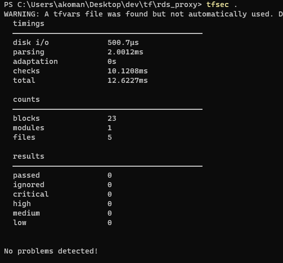
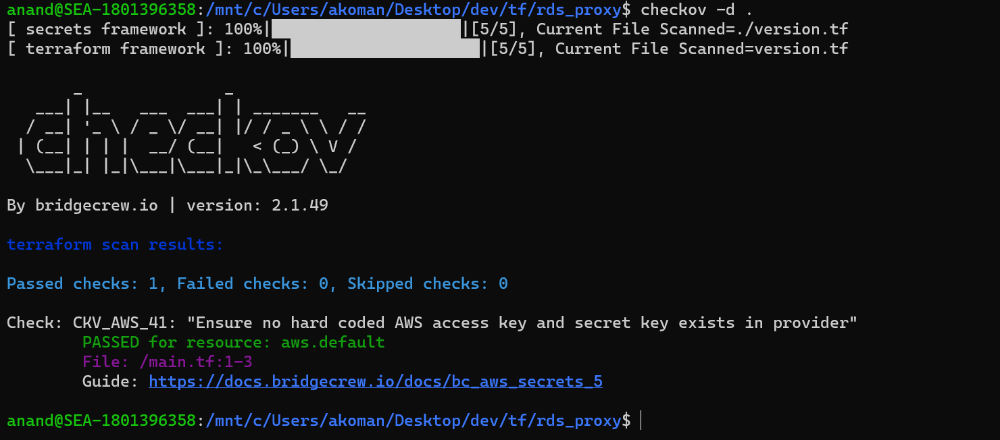

# How to to increase application scalability, performance, and availability when using Amazon RDS for PostgreSQL?

PostgreSQL is implemented using a simple 

When a new connection is received, the main process starts a child process to handle this new connection. The main process goes back to wait for the next connection, and the newly started child process takes care of all activities related to this new client connection. A new child process is started for each new connection received by the database.

Many applications, including those built on modern serverless architectures, can have a large number of open connections to the database server, and may open and close database connections at a high rate, exhausting database memory and compute resources.

Transactional applications frequently opening and closing the connections will experience higher connection latency, resulting in lower transactions per second. This will increase application latency.

A fail-over occurs when the primary database instance becomes inaccessible and another instance takes over as the new primary. This disrupts client connections. Fail-overs can be planned, when they are induced by administrative actions such as a rolling upgrade, or unplanned, when they occur due to failures. In both cases, operators must reduce downtime to minimize client disruption.

Amazon RDS Proxy is a fully managed, highly available database proxy for Amazon Relational Database Service (RDS) that makes applications more scalable, more resilient to database failures, and more secure.

Amazon RDS Proxy allows applications to pool and share connections established with the database, improving database efficiency and application scalability. With RDS Proxy, failover times for Aurora and RDS databases are reduced by up to 66% and database credentials, authentication, and access can be managed through integration with AWS Secrets Manager and AWS Identity and Access Management (IAM).

This project has infrastructure as code to create an Amazon RDS Proxy in your existing architecture with an Amazon RDS PostreSQL database.

# Solution Architecture

# Code Design
The infrastructure as code shared in this project will create an instance of an RDS Proxy service pointing to an existing Postgres database. Code is written in Terraform and expects the following inputs to provision an RDS Proxy successfully. 
- aws_account_id 
- aws_region 
- vpc_id 
- vpc_subnet_filter_tag
- rds_instance_id
- rds_proxy_role
- rds_security_group_name
- rds_secret_name
- rds_proxy_tags

See [input variables file](variables.tf) for a desription of the input variables. 

# Implementation Guide
- See  guide to setup network, proxy role, and secret inputs needed for RDS Proxy
- Download this project files to your local folder
- Initialize your AWS command line
- Initialzie your Terraform command line
- Run terraform plan to see the resources that will added for this RDS Proxy
- Run terraform apply to provision a RDS Proxy on your existing RDS database
- The endpoint created for the new RDS Proxy will be output at the end of provisioning the new RDS Proxy
- Use the RDS Proxy endpoint in your application testing
- When done, you can use terraform destroy to remove the RDS proxy

# Security checks
## tfsec
[tfsec](https://github.com/aquasecurity/tfsec) was used to perform static analysis on the project's infrastructure as code. The results are shown below

## checkov
[checkov](https://www.checkov.io/) was also used to perform static analysis on the project's infrastructure as code. The results are shown below 

# Next steps
Go implement RDS Proxy and increase your application's scalability, performance, and resiliency when using Amazon RDS. You can see [pricing here.](https://aws.amazon.com/rds/proxy/pricing/)

# References

